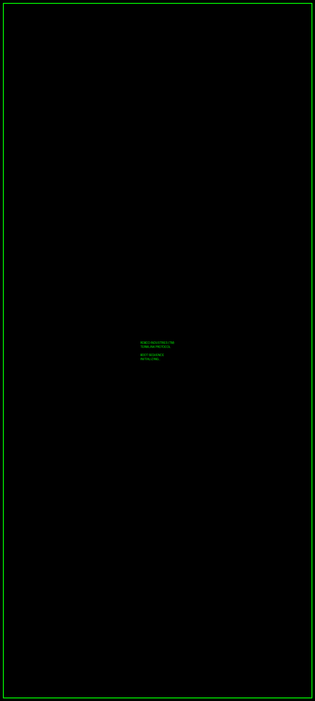
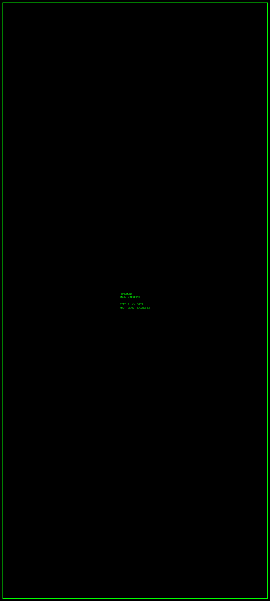
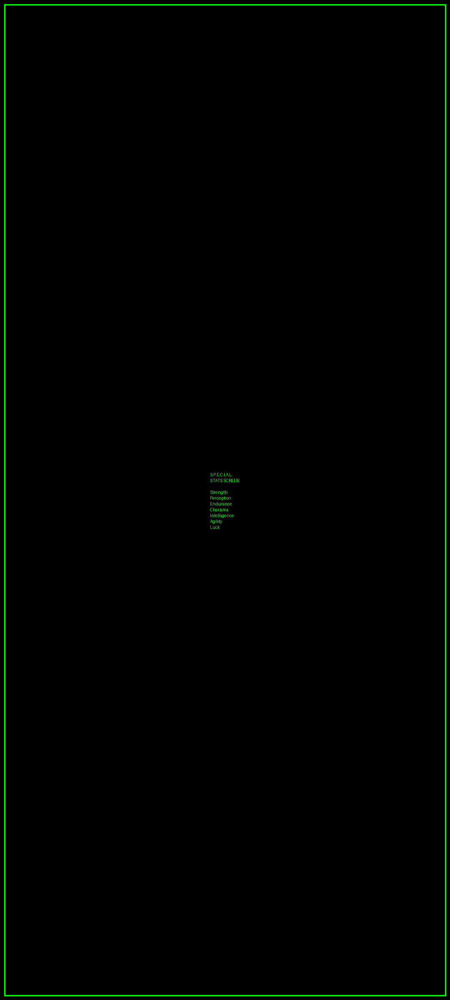
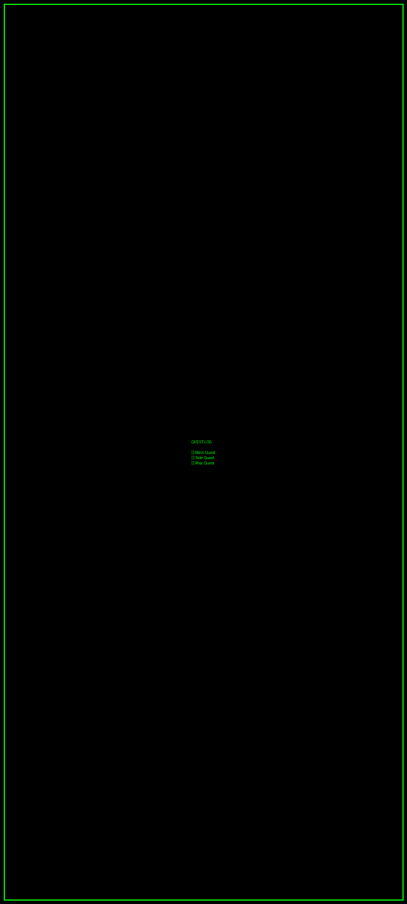
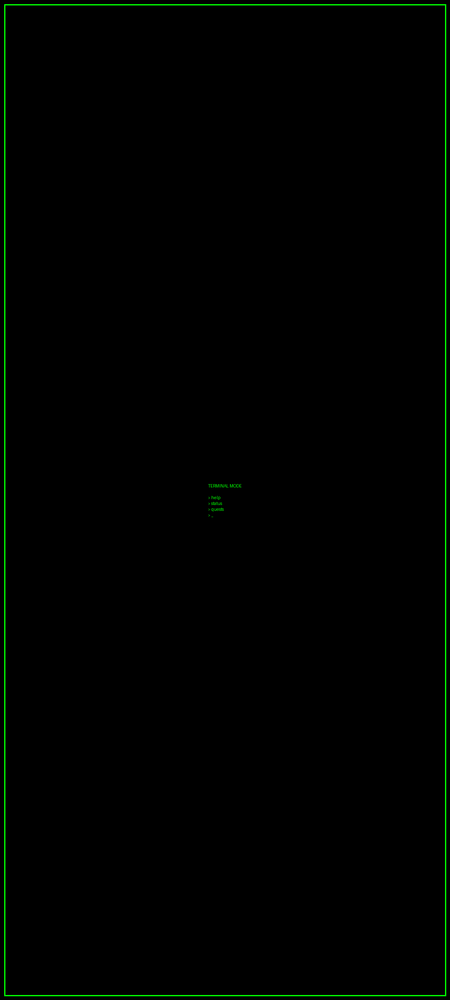
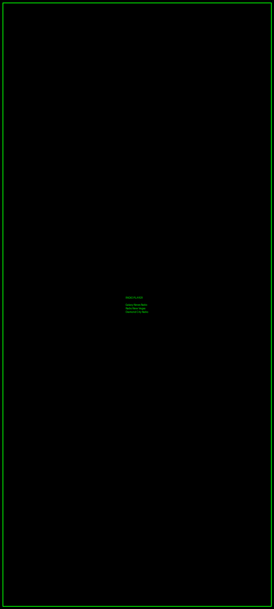

# 🎮 Pip-Droid Launcher

<div align="center">


**A retro-futuristic Android launcher inspired by Fallout's Pip-Boy 3000**

[](https://github.com/Snapwave333/pip-droid/releases)
[](https://developer.android.com)
[](https://kotlinlang.org)
[](LICENSE)

[Features](#features) • [Screenshots](#screenshots) • [Installation](#installation) • [Building](#building) • [Contributing](#contributing)

</div>

---

## 📖 About

**Pip-Droid** transforms your Android device into a **Fallout Pip-Boy 3000 Mark IV**, complete with authentic CRT effects, S.P.E.C.I.A.L. stats tracking, quest management, and a fully functional terminal interface. Experience the wasteland aesthetic on your daily driver.

### 🎯 Why Pip-Droid?

- **🎮 Gamification**: Track phone usage as RPG stats (S.P.E.C.I.A.L. system)
- **📋 Productivity**: Quest log with branching logic, due dates, and rewards
- **💻 Power User**: Terminal mode with 40+ commands and Easter eggs
- **🎨 Authentic**: CRT scanlines, phosphor glow, screen flicker
- **📻 Immersive**: Fallout.FM radio stations with 8 themed channels
- **⚙️ Functional**: Full launcher replacement with all Android features

---

## ✨ Features

### 🎯 **Core Launcher**
- ✅ Full Android home screen replacement
- ✅ App drawer with Pip-Boy styling
- ✅ Six main tabs (Status, Inventory, Data, Map, Radio, Holotapes)
- ✅ Smooth navigation with predictive back gestures
- ✅ Customizable color themes (Green, Amber, Blue, White)
- ✅ Terminal boot sequence on launch

### 📊 **S.P.E.C.I.A.L. Stats System**
Track real phone usage mapped to Fallout stats:
- **Strength** - Storage usage, heavy apps
- **Perception** - Notifications, sensor activity
- **Endurance** - Battery life, uptime
- **Charisma** - Contacts, social apps
- **Intelligence** - Productivity apps, documents
- **Agility** - Response time, gestures
- **Luck** - Quest completion, achievements

**Features**:
- Level progression (1-10 per stat)
- XP tracking with progress bars
- Detailed stat descriptions and effects
- Total level and XP display

### 📝 **Quest Log System**
Turn your tasks into wasteland quests:
- Create, edit, and delete quests
- 5 categories: Main, Side, Misc, Recurring, Faction
- Priority levels: Critical, High, Normal, Low
- Due dates with calendar picker
- Reminders (1 day before)
- Multi-line objectives with checkboxes
- XP and Caps rewards
- Branching quest chains (prerequisites)
- Google Calendar/Tasks integration ready

### 💻 **Terminal Mode**
Access a fully functional RobCo Termlink:
- **40+ commands**: `help`, `status`, `stats`, `quests`, `inv`, `radio`, `map`, etc.
- **20+ Easter eggs**: Try `war`, `gary`, `tunnelsnakes`, `vault 13`, `nuka`, and more
- Command history with up/down arrow navigation
- Color-coded output (green for normal, red for errors)
- Real system integration

### 📺 **CRT Visual Effects**
Authentic retro display simulation:
- Scanlines (horizontal CRT lines)
- Phosphor glow (pulsing green effect)
- Scanline sweep (animated electron beam)
- Screen flicker (random brightness variations)
- Vignette (darkened corners)
- Curvature simulation (edge darkening)
- Toggleable in settings

### 📻 **Radio System**
Listen to Fallout-themed stations:
- Galaxy News Radio
- Radio New Vegas
- Diamond City Radio
- Fallout 4 Classical Radio
- Fallout.FM Main
- Fallout 76 Appalachia Radio
- Fallout 1 & 2 Original Soundtrack
- Bonus: Megaton Radio

**Features**:
- Station browser with metadata
- Volume control
- Playback controls
- Safe, crash-proof streaming

### 🗺️ **Additional Screens**
- **Inventory**: Browse all installed apps
- **Map**: Local map display (waypoints coming soon)
- **Data**: Notes, calendar, message log
- **Holotapes**: Access terminal and mini-games (coming soon)

---

## 📸 Screenshots

<div align="center">

### Boot Sequence


### Main Interface


### S.P.E.C.I.A.L. Stats


### Quest Log


### Terminal Mode


### Radio Player


</div>

---

## 📦 Installation

### Option 1: Download APK (Recommended)
1. Go to [Releases](https://github.com/Snapwave333/pip-droid/releases)
2. Download `PipDroid-v0.1.0-beta.apk`
3. Enable "Unknown Sources" in your Android settings
4. Install the APK
5. Press Home button → Select "Pip-Droid" → Tap "Always"

### Option 2: Build from Source
See [Building from Source](#building-from-source) below.

### Requirements
- Android 14+ (API 34+)
- ~50MB storage space
- Internet connection (for radio streaming)

---

## 🔨 Building from Source

### Prerequisites
- **Android Studio** Hedgehog (2023.1.1) or later
- **JDK 17** or later
- **Gradle 8.5** or later
- **Android SDK 34+**

### Build Steps

```bash
# Clone the repository
git clone https://github.com/Snapwave333/pip-droid.git
cd pip-droid

# Build debug APK
./gradlew assembleDebug

# Build release APK (requires keystore)
./gradlew assembleRelease

# Install directly to connected device
./gradlew installDebug
```

### Output
- **Debug APK**: `build/outputs/apk/debug/PipDroid-debug.apk`
- **Release APK**: `build/outputs/apk/release/PipDroid-release.apk`

### Development Setup

```bash
# Open in Android Studio
File → Open → Select pip-droid folder

# Sync Gradle
File → Sync Project with Gradle Files

# Run on device/emulator
Run → Run 'app'
```

---

## 🏗️ Project Structure

```
pip-droid/
├── src/
│   ├── main/
│   │   ├── java/com/supernova/pipboy/
│   │   │   ├── ui/
│   │   │   │   ├── screens/          # Main app screens
│   │   │   │   ├── components/       # Reusable UI components
│   │   │   │   ├── effects/          # CRT visual effects
│   │   │   │   ├── theme/            # App theming
│   │   │   │   └── viewmodel/        # ViewModels
│   │   │   ├── data/
│   │   │   │   ├── model/            # Data models
│   │   │   │   ├── repository/       # Data repositories
│   │   │   │   ├── quests/           # Quest system
│   │   │   │   ├── stats/            # S.P.E.C.I.A.L. stats
│   │   │   │   └── terminal/         # Terminal commands
│   │   │   ├── navigation/           # Navigation logic
│   │   │   └── PipBoyApplication.kt
│   │   ├── res/                      # Resources (layouts, images, etc.)
│   │   └── AndroidManifest.xml
│   ├── domain/                       # Domain layer module
│   └── feature-status/               # Feature modules
├── docs/
│   ├── images/                       # Screenshots and assets
│   └── guides/                       # User guides
├── build.gradle
├── settings.gradle
├── README.md
├── CHANGELOG.md
├── CONTRIBUTING.md
└── LICENSE
```

---

## 🎨 Architecture

Pip-Droid follows **Clean Architecture** principles:

```
┌─────────────────────────────────────┐
│         Presentation Layer          │
│  (Jetpack Compose UI + ViewModels)  │
├─────────────────────────────────────┤
│          Domain Layer               │
│     (Business Logic + Models)       │
├─────────────────────────────────────┤
│           Data Layer                │
│  (Repositories + DataStore + API)   │
└─────────────────────────────────────┘
```

### Key Technologies
- **UI**: Jetpack Compose
- **Language**: Kotlin
- **Architecture**: MVVM + Clean Architecture
- **Async**: Coroutines + Flow
- **Persistence**: DataStore + Gson
- **Navigation**: Navigation Compose
- **DI**: Hilt (setup ready)

---

## 🛠️ Configuration

### Customization Options

#### Theme Colors
Navigate to **Settings** to change the color scheme:
- Pip-Boy Green (default)
- Amber
- Blue
- White

#### CRT Effects
Toggle individual effects in **Settings**:
- Scanlines
- Flicker
- Screen distortion

#### Quest Settings
- Configure XP/Caps rewards
- Set default reminder times
- Choose quest categories

---

## 📋 Roadmap

### ✅ Completed (v0.1.0-beta)
- [x] Full launcher functionality
- [x] S.P.E.C.I.A.L. stats system
- [x] Quest log with CRUD operations
- [x] Terminal mode with 40+ commands
- [x] CRT visual effects
- [x] Radio player with 8 stations
- [x] Boot sequence animation

### 🚧 In Progress
- [ ] Sound effects system
- [ ] Achievement/perk system
- [ ] Enhanced inventory management
- [ ] Local radio station scraping

### 🔮 Planned
- [ ] Holotape mini-games (Red Menace, Atomic Command)
- [ ] Map waypoints and quest markers
- [ ] Widget system (home screen widgets)
- [ ] Full Google Calendar/Tasks sync
- [ ] Voice command support
- [ ] Cloud backup/sync

See [ROADMAP.md](docs/ROADMAP.md) for detailed feature timeline.

---

## 🤝 Contributing

We welcome contributions! Please see [CONTRIBUTING.md](CONTRIBUTING.md) for guidelines.

### How to Contribute
1. Fork the repository
2. Create a feature branch (`git checkout -b feature/amazing-feature`)
3. Commit your changes (`git commit -m 'Add amazing feature'`)
4. Push to the branch (`git push origin feature/amazing-feature`)
5. Open a Pull Request

### Areas We Need Help
- 🎮 Mini-game development
- 🎨 UI/UX improvements
- 🔊 Sound effect creation
- 📝 Documentation
- 🌐 Translations
- 🐛 Bug reports

---

## 🐛 Known Issues

- Radio streaming requires internet connection
- Some CRT effects may impact battery life on older devices
- Google Calendar sync is stub implementation (manual sync needed)
- Mini-games not yet implemented

See [Issues](https://github.com/Snapwave333/pip-droid/issues) for full list.

---

## 📄 License

This project is licensed under the **MIT License** - see [LICENSE](LICENSE) file for details.

### Third-Party Assets
- Fallout.FM radio streams (used with permission)
- Fallout game assets remain property of Bethesda Softworks LLC
- This is a fan project and not affiliated with Bethesda

---

## 🙏 Acknowledgments

- **Bethesda Game Studios** for creating the Fallout universe
- **RobCo Industries** (fictional) for the Pip-Boy design
- **Fallout.FM** for providing radio streams
- **Android Open Source Project** for the platform
- All contributors and testers

---

## 📞 Support

- **Issues**: [GitHub Issues](https://github.com/Snapwave333/pip-droid/issues)
- **Discussions**: [GitHub Discussions](https://github.com/Snapwave333/pip-droid/discussions)
- **Wiki**: [Project Wiki](https://github.com/Snapwave333/pip-droid/wiki)

---

## 📊 Stats


---

<div align="center">

**War. War never changes. But your Android launcher just got a whole lot cooler.** ☢️

Made with ❤️ by wasteland survivors

[⬆ Back to Top](#-pip-droid-launcher)

</div>
