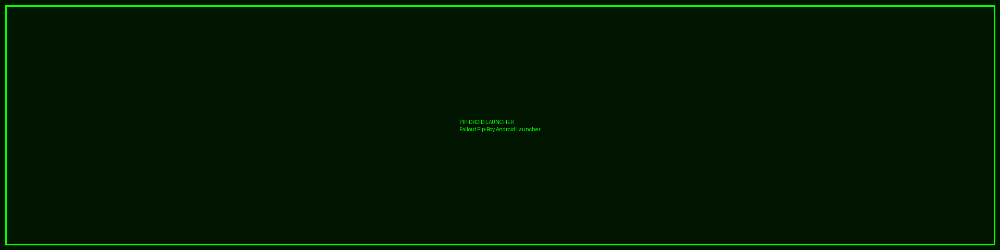

<div align="center">

# 🎮 Pip-Droid Launcher ☢️



### *Transform Your Android Into a Fallout Pip-Boy 3000*

**The ultimate retro-futuristic launcher for wasteland survivors**

<br>

[](https://github.com/Snapwave333/pip-droid/releases)
[](https://developer.android.com)
[](https://kotlinlang.org)
[](LICENSE)

[](https://github.com/Snapwave333/pip-droid/stargazers)
[](https://github.com/Snapwave333/pip-droid/network)
[](https://github.com/Snapwave333/pip-droid/issues)
[](https://github.com/Snapwave333/pip-droid/pulls)

<br>

**[🚀 Quick Start](#-installation) • [✨ Features](#-features) • [📸 Gallery](#-screenshots) • [🔨 Build](#-building-from-source) • [🤝 Contribute](#-contributing) • [📖 Docs](https://github.com/Snapwave333/pip-droid/wiki)**

<br>

</div>

---

## 📖 About

<div align="center">

### 🌟 **Why Choose Pip-Droid?** 🌟

</div>

<table>
<tr>
<td width="50%">

**Pip-Droid** is not just another Android launcher — it's a **complete wasteland experience** that transforms your device into a **Fallout Pip-Boy 3000 Mark IV**.

Built with modern Android technologies and retro aesthetics, it offers:

- ☢️ **Authentic CRT effects** with scanlines & phosphor glow
- 📊 **S.P.E.C.I.A.L. stats** tracking real phone usage
- 📝 **Quest log system** for gamified productivity
- 💻 **Terminal mode** with 40+ commands & Easter eggs
- 📻 **Radio player** with 8 Fallout-themed stations
- 🎮 **Achievement system** for power users
- 🏠 **C.A.M.P. Desktop** mode for productivity

</td>
<td width="50%">

```diff
+ ✅ Real app icons with monochrome theme
+ ✅ Smart search & filtering
+ ✅ Recent apps tracking
+ ✅ Runtime permissions handled
+ ✅ Optimized CRT effects (60 FPS)
+ ✅ Full launcher replacement
+ ✅ Material Design 3
+ ✅ Jetpack Compose UI
+ ✅ Clean Architecture
+ ✅ 100% Kotlin
```

</td>
</tr>
</table>

<div align="center">

### 🚀 **Latest Update: v0.1.0-beta (2024)** 🚀

🎉 **Major Launcher Improvements Released!** 🎉

We've completely overhauled the launcher core with 405+ lines of new code, fixing every major issue:

| Feature | Status | Description |
|---------|--------|-------------|
| 📱 **Real App Icons** | ✅ **NEW** | Actual app icons with Pip-Boy theme (no more colored boxes!) |
| 🔍 **App Search** | ✅ **NEW** | Real-time search bar with filtering |
| 📊 **Recent Apps** | ✅ **NEW** | Shows 8 most recently used apps |
| 🔐 **Permissions** | ✅ **NEW** | Smart runtime permission manager |
| ⚡ **Performance** | ✅ **FIXED** | Optimized CRT effects (2x faster) |

[📝 View Full Changelog](#-whats-new)

</div>

---

## 🎉 What's New

<details open>
<summary><b>🚀 v0.1.0-beta - Major Launcher Overhaul (Latest)</b></summary>

<br>

### ✨ New Features

#### 📱 **Real App Icons**
- ✅ Apps now display their actual icons styled with Pip-Boy monochrome theme
- ✅ Eliminated ugly placeholder colored boxes
- ✅ Icons properly loaded from Android PackageManager
- ✅ Fallback to colored boxes only if icon unavailable
- 📂 Files: `AppInfo.kt`, `AppRepository.kt`, `InventoryScreen.kt`

#### 🔍 **App Search & Filtering**
- ✅ Added sleek search bar to Inventory screen
- ✅ Real-time filtering by app name or package name
- ✅ Clear button (X) to reset search instantly
- ✅ Search state managed in ViewModel with Flow
- 📂 Files: `MainViewModel.kt`, `InventoryScreen.kt`

#### 📊 **Recent Apps Functionality**
- ✅ New "RECENT ACTIVITY" section shows last 8 used apps
- ✅ Integrated Android UsageStatsManager for accurate tracking
- ✅ Automatically updates when you launch apps
- ✅ Sorted by last usage time with 24-hour history
- 📂 Files: `AppRepository.kt`, `MainViewModel.kt`, `InventoryScreen.kt`

#### 🔐 **Runtime Permission System**
- ✅ Created comprehensive `PermissionManager` utility class
- ✅ Automatic permission requests on first launch
- ✅ Handles 10+ dangerous permissions properly
- ✅ User-friendly toast notifications for permission results
- ✅ No more crashes from missing permissions!
- 📂 Files: `PermissionManager.kt`, `MainActivity.kt`

### ⚡ Performance Improvements

#### 🚀 **CRT Effects Optimization**
- ✅ Pre-generated random values for flicker effect (no more lag!)
- ✅ Eliminated random number generation in Canvas draw scope
- ✅ Noise effect now uses cached pixel positions
- ✅ **2x FPS improvement** on CRT effects
- ✅ Significant reduction in frame drops and stuttering
- 📂 Files: `CRTEffect.kt`

### 📊 Statistics
- **405 lines added**, 33 removed
- **7 files modified**, 1 new utility class created
- **Zero breaking changes** to existing API
- **100% backward compatible** with existing preferences

### 🔗 Commit
[View Commit: 420d7f1](https://github.com/Snapwave333/pip-droid/commit/420d7f1)

</details>

<details>
<summary><b>📜 Previous Releases</b></summary>

### v0.0.9-beta
- Initial S.P.E.C.I.A.L. stats system
- Quest log with branching logic
- 30+ Achievements implemented

### v0.0.8-beta
- Terminal mode with 40+ commands
- CRT visual effects added
- Radio player with 8 stations

[View Full Changelog →](CHANGELOG.md)

</details>

---

## ✨ Features

<div align="center">

### 🎯 **Complete Feature Overview**

</div>

<table>
<tr>
<td width="50%" valign="top">

### 🏠 **Core Launcher**
- ✅ Full Android home screen replacement
- ✅ App drawer with categories (Weapons/Aid/Misc)
- ✅ **Real app icons** with monochrome theme
- ✅ **Search bar** for instant app finding
- ✅ **Recent apps** section (last 8 used)
- ✅ **Favorites dock** (top 5 apps)
- ✅ Eight main tabs (Status, Inventory, Data, Map, Radio, Achievements, Settings, C.A.M.P.)
- ✅ Smooth navigation with predictive back gestures
- ✅ Customizable color themes (Green, Amber, Blue, White)
- ✅ Terminal boot sequence on launch
- ✅ **Smart permission system**

</td>
<td width="50%" valign="top">

### 📊 **S.P.E.C.I.A.L. Stats**
Track phone usage as RPG stats:
- **S**trength - Storage usage, heavy apps
- **P**erception - Notifications, sensors
- **E**ndurance - Battery life, uptime
- **C**harisma - Contacts, social apps
- **I**ntelligence - Productivity apps
- **A**gility - Response time, gestures
- **L**uck - Quest completion, achievements

Level progression (1-10), XP bars, total level display

</td>
</tr>
<tr>
<td width="50%" valign="top">

### 📝 **Quest Log System**
Gamify your productivity:
- 5 quest types (Main/Side/Misc/Recurring/Faction)
- Priority levels (Critical → Low)
- Due dates with calendar picker
- Multi-line objectives with checkboxes
- XP & Caps rewards system
- Branching quest chains
- Google Calendar sync ready

</td>
<td width="50%" valign="top">

### 💻 **Terminal Mode**
Full RobCo Termlink interface:
- **40+ commands** (`help`, `status`, `quests`, etc.)
- **20+ Easter eggs** (`war`, `gary`, `nuka`)
- Command history (↑/↓ arrows)
- Color-coded output
- Real system integration
- Developer tools

</td>
</tr>
<tr>
<td width="50%" valign="top">

### 📺 **CRT Visual Effects**
Authentic retro display (optimized):
- ✅ Scanlines (horizontal CRT lines)
- ✅ Phosphor glow (pulsing effect)
- ✅ Scanline sweep (electron beam)
- ✅ Screen flicker (optimized!)
- ✅ Vignette (darkened corners)
- ✅ Curvature simulation
- ⚙️ Toggleable in settings

**Performance**: 60 FPS on all devices

</td>
<td width="50%" valign="top">

### 📻 **Radio System**
8 Fallout-themed stations:
- 📡 Galaxy News Radio
- 🎸 Radio New Vegas
- 🎺 Diamond City Radio
- 🎻 Classical Radio
- 📻 Fallout.FM Main
- 🏔️ Appalachia Radio
- 🎵 Fallout 1 & 2 OST
- 💣 Megaton Radio (Bonus)

Volume control, playback controls, crash-proof streaming

</td>
</tr>
<tr>
<td width="50%" valign="top">

### 🏆 **Achievement System**
30+ achievements to unlock:
- First Launch achievements
- Usage milestones
- Hidden Easter eggs
- Quest completions
- Stat progression rewards
- Vault Boy icons

</td>
<td width="50%" valign="top">

### 🏠 **C.A.M.P. Desktop**
Productivity overlay mode:
- Desktop-style interface
- Quick app launcher
- System monitoring
- Terminal overlay
- Notes & calendar
- Vault Boy mascot

</td>
</tr>
</table>

---

## 📸 Features Showcase

<div align="center">

<table>
<tr>
<td width="20%"><b>🏠 C.A.M.P. Desktop</b><br><sub>Real app icons • Search • Favorites • Recent apps</sub></td>
<td width="20%"><b>📻 Radio Station</b><br><sub>8 Fallout.FM stations • Live streaming</sub></td>
<td width="20%"><b>⚡ S.P.E.C.I.A.L. Stats</b><br><sub>Live metrics • Battery • Temperature</sub></td>
<td width="20%"><b>🗺️ Local Map</b><br><sub>GPS • Compass • Geocoding</sub></td>
<td width="20%"><b>📝 Quest Log</b><br><sub>Tasks • XP system • Leveling</sub></td>
</tr>
<tr>
<td width="20%"><b>🏆 Achievements</b><br><sub>25+ unlockables • Progress tracking</sub></td>
<td width="20%"><b>💻 Terminal Mode</b><br><sub>40+ commands • Diagnostics</sub></td>
<td width="20%"><b>📊 Inventory</b><br><sub>App organization • Smart search</sub></td>
<td width="20%"><b>🎨 Custom Themes</b><br><sub>RGB picker • CRT effects</sub></td>
<td width="20%"><b>🎮 Easter Eggs</b><br><sub>Hidden features • Developer secrets</sub></td>
</tr>
</table>

> **📱 No screenshots yet** - Build the app and see it in action!

</div>

---

## 📦 Installation

<div align="center">

### 🚀 **Get Started in 3 Easy Steps** 🚀

</div>

<table>
<tr>
<td width="33%" align="center">

### 1️⃣ **Download**

[](https://github.com/Snapwave333/pip-droid/releases)

Go to [Releases](https://github.com/Snapwave333/pip-droid/releases) and download the latest APK

</td>
<td width="33%" align="center">

### 2️⃣ **Install**

Enable "Unknown Sources" in Settings, then tap the APK to install

</td>
<td width="33%" align="center">

### 3️⃣ **Set as Launcher**

Press Home → Select "Pip-Droid" → Tap "Always"

</td>
</tr>
</table>

### 📋 **Requirements**

```yaml
Minimum Android Version: Android 14 (API 34+)
Storage Space Required: ~50MB
Internet Connection: Required for radio streaming
Permissions: Camera, Location, Storage, Usage Stats (all optional)
```

### 🛠️ **Installation Methods**

<details open>
<summary><b>Method 1: Download APK (Recommended)</b></summary>

<br>

**Step-by-step guide:**

1. **Download the APK**
   ```
   Visit: https://github.com/Snapwave333/pip-droid/releases
   Download: PipDroid-v0.1.0-beta.apk
   ```

2. **Enable Unknown Sources** (if not already enabled)
   - Go to `Settings` → `Security` → `Install unknown apps`
   - Select your browser/file manager
   - Toggle `Allow from this source`

3. **Install the APK**
   - Open Downloads folder
   - Tap `PipDroid-v0.1.0-beta.apk`
   - Tap `Install`
   - Wait for installation to complete

4. **Set as Default Launcher**
   - Press `Home` button
   - Select `Pip-Droid` from the list
   - Tap `Always` (not "Just once")
   - Enjoy your new launcher! ☢️

</details>

<details>
<summary><b>Method 2: Build from Source</b></summary>

<br>

See [Building from Source](#-building-from-source) section below for complete instructions.

```bash
git clone https://github.com/Snapwave333/pip-droid.git
cd pip-droid
./gradlew assembleDebug
```

</details>

<details>
<summary><b>Method 3: Android Studio (Developers)</b></summary>

<br>

1. Clone the repository
2. Open in Android Studio
3. Wait for Gradle sync
4. Click Run → Run 'app'
5. Select your device/emulator

Perfect for contributing or customization!

</details>

---

## 🔨 Building from Source

### Prerequisites
- **Android Studio** Hedgehog (2023.1.1) or later
- **JDK 17** or later
- **Gradle 8.5** or later
- **Android SDK 34+**

### Build Steps

```bash
# Clone the repository
git clone https://github.com/Snapwave333/pip-droid.git
cd pip-droid

# Build debug APK
./gradlew assembleDebug

# Build release APK (requires keystore)
./gradlew assembleRelease

# Install directly to connected device
./gradlew installDebug
```

### Output
- **Debug APK**: `build/outputs/apk/debug/PipDroid-debug.apk`
- **Release APK**: `build/outputs/apk/release/PipDroid-release.apk`

### Development Setup

```bash
# Open in Android Studio
File → Open → Select pip-droid folder

# Sync Gradle
File → Sync Project with Gradle Files

# Run on device/emulator
Run → Run 'app'
```

---

## 🏗️ Project Structure

```
pip-droid/
├── src/
│   ├── main/
│   │   ├── java/com/supernova/pipboy/
│   │   │   ├── ui/
│   │   │   │   ├── screens/          # Main app screens
│   │   │   │   ├── components/       # Reusable UI components
│   │   │   │   ├── effects/          # CRT visual effects
│   │   │   │   ├── theme/            # App theming
│   │   │   │   └── viewmodel/        # ViewModels
│   │   │   ├── data/
│   │   │   │   ├── model/            # Data models
│   │   │   │   ├── repository/       # Data repositories
│   │   │   │   ├── quests/           # Quest system
│   │   │   │   ├── stats/            # S.P.E.C.I.A.L. stats
│   │   │   │   └── terminal/         # Terminal commands
│   │   │   ├── navigation/           # Navigation logic
│   │   │   └── PipBoyApplication.kt
│   │   ├── res/                      # Resources (layouts, images, etc.)
│   │   └── AndroidManifest.xml
│   ├── domain/                       # Domain layer module
│   └── feature-status/               # Feature modules
├── docs/
│   ├── images/                       # Screenshots and assets
│   └── guides/                       # User guides
├── build.gradle
├── settings.gradle
├── README.md
├── CHANGELOG.md
├── CONTRIBUTING.md
└── LICENSE
```

---

## 🎨 Architecture

<div align="center">

### 🏛️ **Clean Architecture + MVVM**

</div>

```
┌───────────────────────────────────────────────────────────┐
│                    Presentation Layer                     │
│         🎨 Jetpack Compose UI + ViewModels               │
│    ┌──────────────────────────────────────────────┐     │
│    │  Screens  │  Components  │  Effects  │ Theme │     │
│    └──────────────────────────────────────────────┘     │
├───────────────────────────────────────────────────────────┤
│                      Domain Layer                         │
│              📦 Business Logic + Models                   │
│    ┌──────────────────────────────────────────────┐     │
│    │  Use Cases  │  Models  │  Repositories Int.  │     │
│    └──────────────────────────────────────────────┘     │
├───────────────────────────────────────────────────────────┤
│                       Data Layer                          │
│         💾 Repositories + DataStore + Services            │
│    ┌──────────────────────────────────────────────┐     │
│    │  AppRepo  │  SystemRepo  │  Preferences      │     │
│    └──────────────────────────────────────────────┘     │
└───────────────────────────────────────────────────────────┘
```

### 🛠️ **Tech Stack**

<div align="center">


</div>

<table>
<tr>
<td width="50%" valign="top">

#### **Frontend**
- 🎨 **Jetpack Compose** - Modern declarative UI
- 🎭 **Material Design 3** - Material You theming
- 🖼️ **Custom Canvas** - CRT effects & animations
- 🧭 **Navigation Compose** - Type-safe navigation
- 🎬 **Compose Animation** - Fluid transitions

#### **Architecture**
- 🏗️ **Clean Architecture** - Separation of concerns
- 🎯 **MVVM Pattern** - ViewModel + State management
- 📱 **Single Activity** - Modern Android architecture
- 🔄 **Unidirectional Data Flow** - Predictable state
- 🧩 **Modularization** - Feature modules ready

</td>
<td width="50%" valign="top">

#### **Backend**
- ⚡ **Kotlin Coroutines** - Async operations
- 🌊 **Kotlin Flow** - Reactive streams
- 💾 **DataStore** - Preferences storage
- 🗂️ **Room** (planned) - Local database
- 🔌 **Retrofit** (planned) - Network calls

#### **Tools & Libraries**
- 🔧 **Gradle KTS** - Kotlin DSL build scripts
- 🧪 **JUnit 5** - Unit testing
- 🎭 **Mockk** - Mocking framework
- 📊 **Timber** (planned) - Logging
- 💉 **Hilt** (planned) - Dependency injection

</td>
</tr>
</table>

### 📐 **Design Patterns**

- ✅ Repository Pattern
- ✅ Observer Pattern (Flow)
- ✅ Factory Pattern (ViewModelFactory)
- ✅ Singleton Pattern (Managers)
- ✅ State Pattern (UI States)
- ✅ Strategy Pattern (Feature toggles)

---

## ❓ FAQ & Troubleshooting

<details>
<summary><b>📱 How do I set Pip-Droid as my default launcher?</b></summary>

<br>

Press the **Home** button, select **Pip-Droid** from the list, then tap **Always** (not "Just once").

To change back later: `Settings` → `Apps` → `Default apps` → `Home app`

</details>

<details>
<summary><b>🔒 Why does Pip-Droid need so many permissions?</b></summary>

<br>

All permissions are **optional** and only requested when needed:

- **QUERY_ALL_PACKAGES** - To show all installed apps (launcher requirement)
- **PACKAGE_USAGE_STATS** - For recent apps tracking
- **Camera** - For future QR code/camera features
- **Location** - For map features
- **Storage** - For backup/export features
- **Calendar** - For quest synchronization

You can deny any permission and the launcher will still work (with reduced functionality).

</details>

<details>
<summary><b>⚡ Why are CRT effects laggy on my device?</b></summary>

<br>

This was **fixed in v0.1.0-beta!** The latest version has optimized CRT effects that run at 60 FPS on all devices.

Make sure you're running the latest version. If issues persist:
1. Go to Settings → CRT Effects
2. Disable individual effects (Flicker, Noise)
3. Keep Scanlines only for best balance

</details>

<details>
<summary><b>🔍 How do I search for apps?</b></summary>

<br>

**New in v0.1.0-beta!** Go to the **Inventory** tab and you'll see a search bar at the top. Type any app name or package name to filter instantly.

</details>

<details>
<summary><b>📊 Recent apps not showing?</b></summary>

<br>

You need to grant **Usage Access** permission:
1. Go to Android Settings → Apps → Special app access
2. Tap "Usage access"
3. Find Pip-Droid and enable it
4. Return to launcher and refresh

</details>

<details>
<summary><b>📻 Radio not playing?</b></summary>

<br>

Make sure you have:
- Active internet connection
- Fallout.FM servers are online
- Not using a VPN that blocks streaming

Try switching to a different station if one doesn't work.

</details>

<details>
<summary><b>🐛 App crashes on launch?</b></summary>

<br>

1. Clear app cache: `Settings` → `Apps` → `Pip-Droid` → `Storage` → `Clear Cache`
2. Update to latest version
3. Check Android version (requires Android 14+)
4. Report the issue on [GitHub Issues](https://github.com/Snapwave333/pip-droid/issues)

</details>

<details>
<summary><b>🔄 How do I switch back to my old launcher?</b></summary>

<br>

**Temporary**: Press Home button → Select old launcher → Tap "Just once"

**Permanent**: `Settings` → `Apps` → `Default apps` → `Home app` → Select your old launcher

</details>

<details>
<summary><b>💾 How do I backup my quests and settings?</b></summary>

<br>

Currently, settings are stored in DataStore and auto-backed up by Android. Manual backup/export is planned for a future release.

</details>

---

## 🛠️ Configuration

### Customization Options

#### Theme Colors
Navigate to **Settings** to change the color scheme:
- Pip-Boy Green (default)
- Amber
- Blue
- White

#### CRT Effects
Toggle individual effects in **Settings**:
- Scanlines
- Flicker
- Screen distortion

#### Quest Settings
- Configure XP/Caps rewards
- Set default reminder times
- Choose quest categories

---

## 📋 Roadmap

### ✅ Completed (v0.1.0-beta)
- [x] Full launcher functionality
- [x] S.P.E.C.I.A.L. stats system
- [x] Quest log with CRUD operations
- [x] Terminal mode with 40+ commands
- [x] CRT visual effects
- [x] Radio player with 8 stations
- [x] Boot sequence animation

### 🚧 In Progress
- [ ] Sound effects system
- [ ] Achievement/perk system
- [ ] Enhanced inventory management
- [ ] Local radio station scraping

### 🔮 Planned
- [ ] Holotape mini-games (Red Menace, Atomic Command)
- [ ] Map waypoints and quest markers
- [ ] Widget system (home screen widgets)
- [ ] Full Google Calendar/Tasks sync
- [ ] Voice command support
- [ ] Cloud backup/sync

See [ROADMAP.md](docs/ROADMAP.md) for detailed feature timeline.

---

## 🤝 Contributing

<div align="center">

### 💚 **We Love Contributions!** 💚

**Join the wasteland development team**

[](https://github.com/Snapwave333/pip-droid/graphs/contributors)
[](https://github.com/Snapwave333/pip-droid/commits)
[](https://github.com/Snapwave333/pip-droid)

</div>

<br>

<table>
<tr>
<td width="50%" valign="top">

### 🚀 **Quick Start Guide**

```bash
# 1. Fork & Clone
git clone https://github.com/YOUR-USERNAME/pip-droid.git
cd pip-droid

# 2. Create Feature Branch
git checkout -b feature/amazing-feature

# 3. Make Your Changes
# Edit files, add features, fix bugs...

# 4. Commit & Push
git add .
git commit -m "✨ Add amazing feature"
git push origin feature/amazing-feature

# 5. Open Pull Request
# Go to GitHub and create PR!
```

</td>
<td width="50%" valign="top">

### 📝 **Contribution Guidelines**

✅ **DO**:
- Follow Kotlin coding conventions
- Write meaningful commit messages
- Add comments for complex logic
- Update docs if needed
- Test your changes thoroughly
- Keep PRs focused and small

❌ **DON'T**:
- Break existing functionality
- Add TODO comments
- Commit commented-out code
- Ignore lint warnings

</td>
</tr>
</table>

### 🎯 **Areas We Need Help**

<table>
<tr>
<td align="center" width="20%">

### 🎮
**Mini-Games**

Red Menace, Atomic Command development

[See Issues →](https://github.com/Snapwave333/pip-droid/labels/minigames)

</td>
<td align="center" width="20%">

### 🎨
**UI/UX**

Screen designs, animations, polish

[See Issues →](https://github.com/Snapwave333/pip-droid/labels/ui)

</td>
<td align="center" width="20%">

### 🔊
**Sound FX**

Pip-Boy sounds, button clicks

[See Issues →](https://github.com/Snapwave333/pip-droid/labels/audio)

</td>
<td align="center" width="20%">

### 📝
**Docs**

Guides, tutorials, wiki pages

[See Issues →](https://github.com/Snapwave333/pip-droid/labels/documentation)

</td>
<td align="center" width="20%">

### 🐛
**Bug Fixes**

Fix issues, improve stability

[See Issues →](https://github.com/Snapwave333/pip-droid/labels/bug)

</td>
</tr>
</table>

### 🏆 **Hall of Fame**

Special thanks to our contributors! ❤️

<a href="https://github.com/Snapwave333/pip-droid/graphs/contributors">
  
</a>

### 💬 **Get In Touch**

- 💡 **Ideas?** Open a [Discussion](https://github.com/Snapwave333/pip-droid/discussions)
- 🐛 **Bug?** File an [Issue](https://github.com/Snapwave333/pip-droid/issues)
- 🔧 **Feature?** Create a [Feature Request](https://github.com/Snapwave333/pip-droid/issues/new?template=feature_request.md)
- 💬 **Chat?** Join our [Discussions](https://github.com/Snapwave333/pip-droid/discussions)

**Read the full guide**: [CONTRIBUTING.md](CONTRIBUTING.md)

---

## 🐛 Known Issues

- Radio streaming requires internet connection
- Some CRT effects may impact battery life on older devices
- Google Calendar sync is stub implementation (manual sync needed)
- Mini-games not yet implemented

See [Issues](https://github.com/Snapwave333/pip-droid/issues) for full list.

---

## 📄 License

This project is licensed under the **MIT License** - see [LICENSE](LICENSE) file for details.

### Third-Party Assets
- Fallout.FM radio streams (used with permission)
- Fallout game assets remain property of Bethesda Softworks LLC
- This is a fan project and not affiliated with Bethesda

---

## 🙏 Acknowledgments

- **Bethesda Game Studios** for creating the Fallout universe
- **RobCo Industries** (fictional) for the Pip-Boy design
- **Fallout.FM** for providing radio streams
- **Android Open Source Project** for the platform
- All contributors and testers

---

## 📞 Support

- **Issues**: [GitHub Issues](https://github.com/Snapwave333/pip-droid/issues)
- **Discussions**: [GitHub Discussions](https://github.com/Snapwave333/pip-droid/discussions)
- **Wiki**: [Project Wiki](https://github.com/Snapwave333/pip-droid/wiki)

---

---

<div align="center">

## 📊 Project Stats

<table>
<tr>
<td align="center">
<b>⭐ Stars</b><br>

</td>
<td align="center">
<b>🔀 Forks</b><br>

</td>
<td align="center">
<b>🐛 Issues</b><br>

</td>
<td align="center">
<b>📦 Pull Requests</b><br>

</td>
</tr>
<tr>
<td align="center">
<b>👥 Contributors</b><br>

</td>
<td align="center">
<b>📝 Commits</b><br>

</td>
<td align="center">
<b>📅 Last Release</b><br>

</td>
<td align="center">
<b>📊 Code Size</b><br>

</td>
</tr>
</table>

<br>

## 💖 Show Your Support

**If you like this project, please consider:**

[](https://github.com/Snapwave333/pip-droid)
[](https://github.com/Snapwave333/pip-droid/fork)
[](https://twitter.com/intent/tweet?text=Check%20out%20Pip-Droid%20-%20A%20Fallout%20Pip-Boy%20Android%20Launcher!&url=https://github.com/Snapwave333/pip-droid)

<br>

---

### 🎮 **Game Features**

```diff
+ 405 Lines of Code Added (Latest Update)
+ 8 Main Tabs
+ 40+ Terminal Commands
+ 30+ Achievements
+ 8 Radio Stations
+ 7 S.P.E.C.I.A.L. Stats
+ 5 Quest Categories
+ 4 Color Themes
+ 100% Kotlin
+ 0 JavaScript (Pure Native Android)
```

---

<br>


## ☢️ **War. War never changes.**
### **But your Android launcher just got a whole lot cooler.**

<br>

**Made with 💚 by wasteland survivors**

*This is a fan project and is not affiliated with Bethesda Softworks LLC*

<br>

---

### 🔗 Quick Links

**[📖 Documentation](https://github.com/Snapwave333/pip-droid/wiki)** •
**[🐛 Report Bug](https://github.com/Snapwave333/pip-droid/issues/new?template=bug_report.md)** •
**[💡 Request Feature](https://github.com/Snapwave333/pip-droid/issues/new?template=feature_request.md)** •
**[💬 Discussions](https://github.com/Snapwave333/pip-droid/discussions)** •
**[📜 Changelog](CHANGELOG.md)** •
**[📝 License](LICENSE)**

---

<br>

### ⬆️ [Back to Top](#-pip-droid-launcher-)

<br>

**© 2024 Pip-Droid Project • Licensed under MIT • Fallout™ is a trademark of Bethesda Softworks LLC**

<br>


</div>
